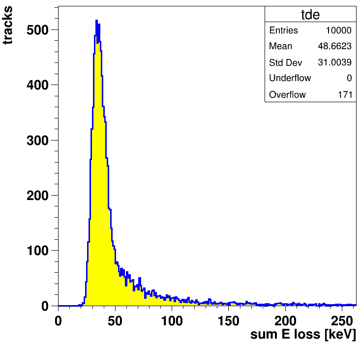

# ionizer

## simulation of ionization by charged particle tracks in silicon

based on  
Hans Bichsel: Straggling in thin silicon detectors  
Rev. Mod. Phys. 60 (1988) 663-99  
http://prola.aps.org/abstract/RMP/v60/i3/p663_1

and  
M. Brigida, M.N. Mazzotti et al:  
A new Monte Carlo code for full simulation of silicon strip detectors  
Nuclear Instruments and Methods in Physics Research A 533 (2004) 322–343

here translated to C++
- ionizer.cpp is without root, produces ion clusters in ionizer.dat
- ionizer.cc with ROOT, produces ionizer.root

